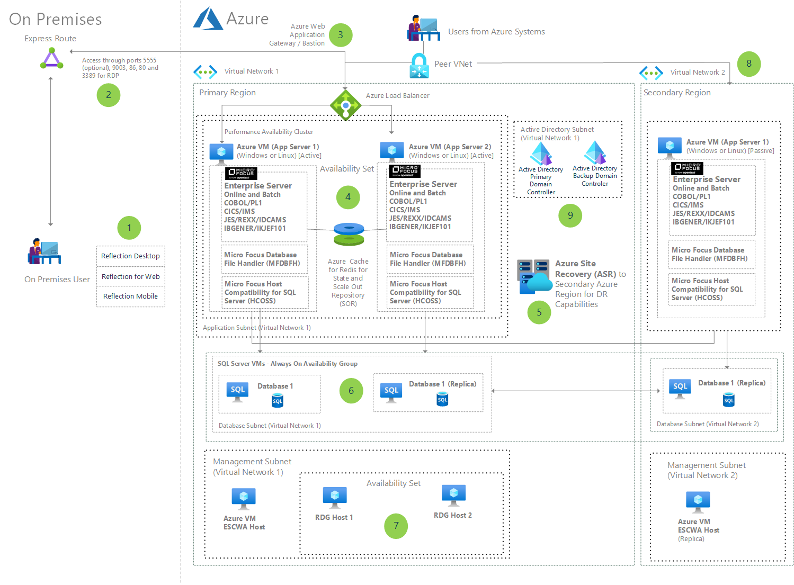
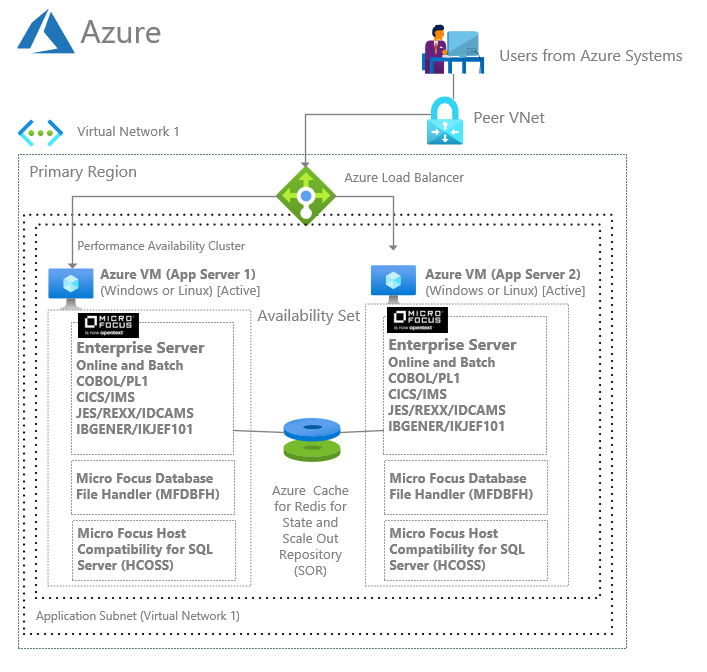

# Azure Mainframe Modernization using OpenText's Micro Focus Enterprise Server

Micro Focus [(now OpenText)](https://www.opentext.com/microfocus) Enterprise Server is an application deployment environment for IBM mainframe applications that have been running on the IBM z/OS operating system. [Enterprise Server](https://www.microfocus.com/en-us/products/enterprise-server/overview) enables you to modernize and integrate your mainframe applications with technologies such as .NET and Java. It also gives you application flexibility across both Linux and Windows, containerized or virtual machines, on Azure. This architecture focuses on virtual machines. Availability and Scalability are implemented using a Performance and Availability Cluster (PAC).

The following architecture is a prescriptive well architected example of an Enterprise Server system in Azure.  It provides for high availability and disaster recovery (HA/DR) by leveraging a failover region in Azure.  This leverages Azure Site Recovery for the VMs in the application tier and a SQL Server Always On configuration for the data tier.

Using the following configuration, you will be able to deploy the infrastructure needed for deploying and running mainframe applications on Azure.

## Architecture

For more details about the architecture, please refer to https://learn.microsoft.com/en-us/azure/architecture/example-scenario/mainframe/micro-focus-server

## Landing Zone Enterprise Server deployment

This deployment includes Azure VMs that will be deployed to run the latest version of Micro Focus Enterprise Server that is available on the Azure marketplace in a performance and availability cluster (PAC), Azure Cache and all the necessary network resources.

## Deploy this scenario
Click on the button below to deploy this configuration:

Follow the deployment steps, fill in the necessary fields and make sure you choose OpenText as the selected partner.

## Recommended next steps
1. Visit Micro Focus Enterprise Server documentation site: https://www.microfocus.com/documentation/enterprise-developer/
1. Check out the [BANKDEMO sample application on GitHub](https://github.com/MicroFocus/BankDemo) which contains source code, deployment scripts and tutorials of Enterprise Server
1. If you don't already have a license to use Enterprise Server, [contact OpenText](https://www.microfocus.com/contact) or [request a trial license](https://www.microfocus.com/en-us/portfolio/enterprise-server/try-now).