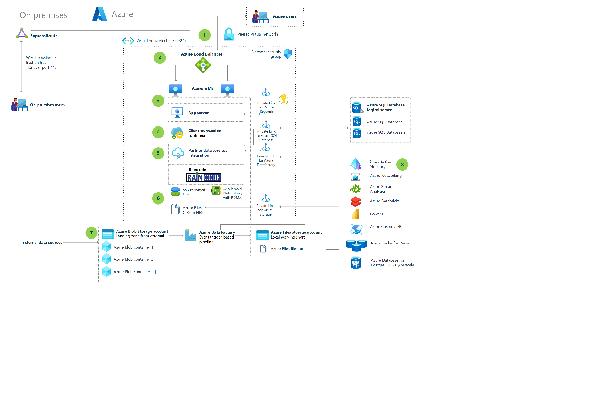
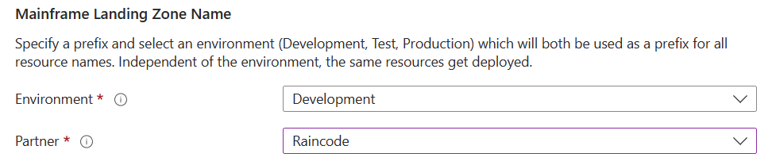

# Azure Mainframe Deployment using Raincode Metal Linux

This reference architecture shows how to run a mainframe deployment using Raincode Suite on Linux. This baseline follows [Well-Architected Framework](https://learn.microsoft.com/en-us/azure/architecture/framework/) pillars to enable a resilient solution. Some of the key benefits of migrating to a cloud infrastructure using Raincode are the following: 
* Enable adoption of a flexible and scalable platform by using the latest technologies through .NET Core.
* Improved customer experience through integration with modern applications such as web and mobile.
* Transformation of your legacy applications into micro- or service-oriented architecture (SOA)
* Control over your total cost of ownership (TCO) through Azure's scalability and availability features.

## Architecture
Raincode Metal Linux is readily available through the Azure Marketplace. The accelerator deploys all the components that are required to run your applications in a cloud-native environment using Raincode Suite on Linux. Note, the components that are built are generally described in the [main](/README.md) page. The key differentiator of this solution is that the virtual machines that are provisioned by the accelerator are built with the latest Raincode Metal Linux Marketplace image. This approach for the deployment ensures that the solution is fully supported by Raincode.  

## Deploy this scenario
Click on the button below to deploy this accelerator solution:

You will need to populate certain fields to enable the deployment. To ensure that this accelerator deploys the virtual machines with the marketplace image that was built and is supported by Raincode, you will have to select "Raincode" for the partner option: 

