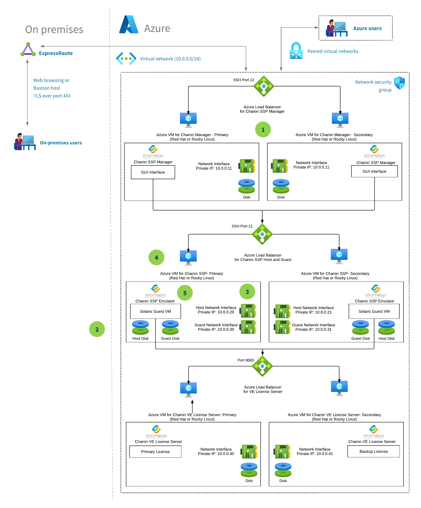

# Azure Mainframe Deployment using Stromasys Charon SSP Emulator for SPARC/Solaris Workloads

This reference architecture shows how to run a deployment of [Stromasys Charon-SSP](https://www.stromasys.com/solutions/charon-ssp) legacy hardware emulation software. This baseline follows [Well-Architected Framework](https://learn.microsoft.com/en-us/azure/architecture/framework/) pillars to enable a resilient solution.

[Charon-SSP](https://www.stromasys.com/solutions/charon-ssp) can run on Azure, emulating legacy SPARC hardware systems with Solaris operating system. On this virtual system (Azure virtual machines), you have the Charon host operating system (Linux) running the Charon emulator software application, which can emulate the configured legacy SPARC hardware that runs your legacy operating system (Solaris) and the associated applications.

By using this configuration, you can run a Solaris workload or application unchanged in an emulation environment on a VM in Azure. The virtual system behaves as though you're using the original hardware.

Some of the key benefits of migrating to a cloud infrastructure using Stromasys emulation products are the following:

* **Business Continuity** - Minimal disruption, as all applications, middleware, and data remain as is, and migrate unchanged.
* **Reduced Risk** - Charon solutions diminish your risk of unplanned downtime by removing the dependency upon classic hardware
* **Lower Costs** - Charon costs less than a full migration and often less than a single-year of classic hardware support.

## Architecture

This architecture includes Azure VMs that will be deployed to run the following software applications:

- **Charon SSP Emulator** - The emulation software for legacy hardware.

- **Charon VE License Server** - Needed to provide an active license to the Charon SSP emulator.

- **Charon Manager** - Remote management of the Charon SSP emulator using a graphical interface.

1. This deployment will create two VMs for each of the above software applications in order to support redundancy / high availability (HA). Thus, the total deployed VMs will be 6 ( 2 x 3). Each pair of VMs will have an associated Azure Load Balancer and Azure Availability Set to provide support for both active-active or active-passive scenarios.

1. The virtual disks for the emulated workloads can reside on the existing host VM disk or you can add extra disks later. For maximum performance we recommend using solid-state drive (SSD) managed disk(s) for storing the virtual disks.

1. Each of the two Charon SSP host VMs will have two host network interface controllers (NICs). One of them will be used for the networking of the host operating system (Linux) and the other will be dedicated to the guest operating system (Solaris) that executes in the emulated environment. Each OS will have its own dedicated private IP address.

   Optional: You can easily set up Azure public IP addresses on the same network interfaces if needed.

1. Users that need to access the Solaris guest OS can connect to the Azure VM running the Linux host OS and from there use telnet to connect to the Solaris guest OS that run on the Charon SSP emulator.

1. Users can also connect via Secure Shell (SSH) directly to the Solaris VMs, if an SSH server is installed and configured on the Solaris guest OS. The Charon-SSP emulator has its own dedicated network interface card which allows the Solaris guest OS to acquire its own IP address. The only restriction is that you should use a non-standard SSH port (not 22) if you access the Solaris guest OS through the Azure Load Balancer. This is because the Azure Load Balancer uses that port for the Linux SSH servers that reside on the Azure VMs.

After deployment completes we recommend to read the [Charon SSP for Azure](https://stromasys.atlassian.net/wiki/spaces/DocCHSSP5xAZRGSupd1/) documentation and the [Charon-SSP for Linux documentation](https://stromasys.atlassian.net/wiki/spaces/KBP/pages/39158047/CHARON-SSP+for+Linux).

## Deploy this scenario
Click on the button below to deploy this accelerator solution:

You will need to populate certain fields to enable the deployment. To ensure that this accelerator deploys the virtual machines with the marketplace image of Charon SSP, you will have to select "Stromasys" for the partner option.

For the best performance, we recommend that the Azure VMs for Charon SSP are compute-optimized [Fsv2-series](https://learn.microsoft.com/en-us/azure/virtual-machines/fsv2-series) or [FX-series](https://learn.microsoft.com/en-us/azure/virtual-machines/fx-series) with 8 ore more virtual CPUs. The required minimum frequency is 3.0 GHz. (3.4 GHz or more is recommended.). The Charon VE License Server and Charon Manager VMs can use any Azure VM series/size.

You can also select to expose a network port associated with an application running your workload on the Solaris guest OS. This can be for example an RDBMS system that serves your databases to clients on the network.
