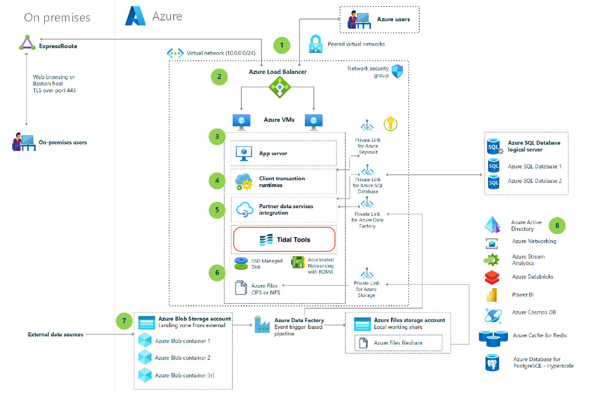
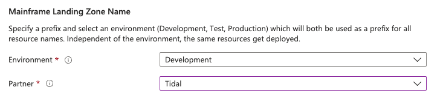

# Azure Mainframe Deployment Assessment using Tidal Accelerator

This reference architecture demonstrates how to execute a deployment of Tidal Tools effectively. The baseline adheres to the principles of the [Well-Architected Framework](https://learn.microsoft.com/en-us/azure/architecture/framework/), which is designed to provide a resilient solution by ensuring operational excellence, security, reliability, performance efficiency, and cost optimization in cloud environments.

In most assessments of application portfolios, legacy applications based on mainframes are often recognized for their significant business value. Tidal's unique, business-focused assessment approach, supported by its comprehensive platform and tools, enables customers to efficiently pinpoint applications ideal for transformation. Contrary to common practice, mainframe applications should not be overlooked during modernization evaluations. Tidal empowers organizations to analyze their mainframe applications, considering both technical complexity and business importance, to facilitate their journey towards cloud integration.

## Architecture

This architecture features the Tidal Tools VM accessible via the Azure Marketplace, along with essential elements outlined in the [Azure Landing Zone Accelerator for Modernized Mainframe and Midrange workloads](https://github.com/lapate/azure-mainframe-landing-zone-public/blob/main/README.md).

Tidal Tools is part of the [Tidal Accelerator platform](https://azuremarketplace.microsoft.com/en-us/marketplace/apps/tidal-migrations.tidalmg_com). Tidal Accelerator has accelerated multiple cloud migration and application management projects to Microsoft Azure at scale. The software is built on a proven methodology and best practices to support the Microsoft Cloud Adoption Framework for Azure for public sector and enterprise customers. Tidal Accelerator’s collaborative, application-centric approach allows you to discover, assess, plan, and manage your migration. Tidal Accelerator is designed and built specifically for enterprises to make high impact changes and informed decisions rapidly in their cloud migrations and transformation projects.

## Deploy

Press the button underneath to implement this accelerator solution.

To initiate the deployment, specific fields must be filled in. For the virtual machine to be deployed using the marketplace image created and maintained by Tidal, it is mandatory to choose "Tidal" as the partner option.

