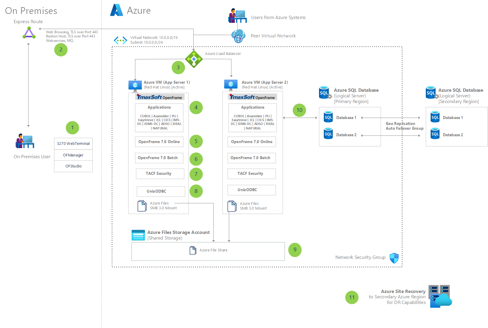

# Migrate IBM mainframe applications to Azure with TmaxSoft OpenFrame

`Bastion` `ExpressRoute` `Files` `SQL Database` `Virtual Machines`

> **Solution ideas**
> This article is a solution idea. If you'd like us to expand the content with more information, such as potential use cases, alternative services, implementation considerations, or pricing guidance, let us know by providing [GitHub feedback](https://github.com/MicrosoftDocs/architecture-center/issues/new).

_Lift and shift_, also known as _rehosting_, is the process of mainframe migration to produce an exact copy of an application, workload, and all associated data from one environment to another. Mainframe applications can be migrated from on-premises to public or private cloud.

TmaxSoft OpenFrame is a rehosting solution that makes it easy to lift-and-shift existing IBM zSeries mainframe applications to Microsoft Azure, using a no-code approach. TmaxSoft quickly migrates an existing application, as is, to a zSeries mainframe emulation environment on Azure.

This article illustrates how the TmaxSoft OpenFrame solution runs on Azure. The approach consists of two virtual machines (VMs) running Linux in an [active-active](https://www.webopedia.com/TERM/A/active_active.html) configuration. An Azure Load Balancer distributes incoming traffic between the VMs. OpenFrame emulation software runs on the VMs and provides a zSeries runtime and facilities. Working with the OpenFrame software is an Azure SQL Database. This modernized database layer includes built-in business continuity features.

## Potential use cases

Many scenarios can benefit from TmaxSoft OpenFrame lift and shift. Possibilities include the following cases:

-   Businesses seeking to modernize infrastructure and escape the high costs, limitations, and rigidity associated with mainframes.
-   Organizations opting to move IBM zSeries mainframe workloads to the cloud without the side effects of a complete redevelopment.
-   IBM zSeries mainframe customers who need to migrate mission-critical applications while maintaining continuity with other on-premises applications.
-   Teams looking for the horizontal and vertical scalability that Azure offers.
-   Businesses that favor solutions offering disaster recovery options.

## Architecture

At the center of the diagram are two virtual machines. Labeled boxes indicate that TmaxSoft OpenFrame software runs on the machines, and each box represents a different type of software. These programs migrate applications to Azure and handle transaction processes. They also manage batch programs and provide security. A load balancer is pictured above the virtual machines. Arrows show that it distributes incoming traffic between the machines. Below the virtual machines, a file sharing system is pictured, and to the right is a database. From arrows, it's clear that the virtual machines communicate with the file share and the database. A dotted line surrounds all these components. Outside that line are on-premises users, Azure users, and disaster recovery services. Arrows show the users interacting with the system.

1.  On-premises users interact with [OpenFrame](https://azuremarketplace.microsoft.com/marketplace/apps/tmaxsoft.openframe?tab=Overview) applications by using 3270 WebTerminal, OFManager, and OFStudio:

    -   The web application 3270 WebTerminal runs in browsers. This app connects users with [Customer Information Control System (CICS)](https://www.ibm.com/support/knowledgecenter/zosbasics/com.ibm.zos.zmidtrmg/zmiddle_13.htm) and [Information Management System - Data Communications (IMS-DC)](https://www.sawaal.com/mainframe-interview-questions/what-is-ims-db-dc_9366) applications. By providing access to these 3270 terminal screens, the 3270 WebTerminal app eliminates the need for TN3270 terminal emulation software.
    -   [OFManager](https://www.tmaxsoft.com/wp-content/uploads/TmaSof_eBook_OpenFrame.pdf) provides tools for executing, monitoring, and managing batch workloads. This web application also monitors and manages datasets and security systems.
    -   [OFStudio](https://www.tmaxsoft.com/wp-content/uploads/TmaSof_eBook_OpenFrame.pdf) provides an IDE for programming, debugging, and maintaining applications.

2.  Azure ExpressRoute creates private connections between the on-premises infrastructure and Azure. Transport Layer Security (TLS) connections that use port 443 provide access to web-based applications:

    -   After migration, the web application presentation layer remains virtually unchanged. As a result, end users require minimal retraining. Alternatively, the web application presentation layer can be updated to align with UX goals.
    -   [Azure VM Bastion hosts](https://learn.microsoft.com/en-us/azure/bastion/bastion-overview) work to maximize security. While giving administrators access to VMs, these hosts minimize the number of open ports.
    -   OpenFrame provides middleware integration. For instance, this functionality works with web services and [message queues (MQs)](https://www.ibm.com/cloud/learn/message-queues).

3.  The TmaxSoft solution uses two VMs. Each one runs an application server, and an Azure Load Balancer manages approaching traffic. OpenFrame supports both [active-active](https://www.webopedia.com/TERM/A/active_active.html) and [active-passive](https://www.jscape.com/blog/active-active-vs-active-passive-high-availability-cluster) configurations.
4.  [OpenFrame language compilers](https://query.prod.cms.rt.microsoft.com/cms/api/am/binary/RE36tt6) migrate COBOL, Assembler, PL/I, Easytrieve, and other mainframe applications to Azure by recompiling the source.
5.  [OpenFrame Online](https://query.prod.cms.rt.microsoft.com/cms/api/am/binary/RE36tt6) provides tools and commands that replace CICS, IMS-DC, Application Development and Maintenance (ADM), and Application Infrastructure and Middleware (AIM) technologies.
6.  [OpenFrame Batch](https://query.prod.cms.rt.microsoft.com/cms/api/am/binary/RE36tt6) provides tools for managing batch programs that replace the job entry subsystem (JES). OpenFrame Batch minimizes code updates by supporting native Job Control Language (JCL) syntax and batch utilities.
7.  Tmax Access Control Facility (TACF) Security provides authentication and authorization features in OpenFrame by extracting and migrating mainframe security rules.
8.  [UnixODBC (Open Database Connectivity)](https://en.wikipedia.org/wiki/UnixODBC) connection drivers communicate with relational database management systems (RDBMSs). Examples include Azure SQL Database, Microsoft SQL Server, Oracle, Db2 LUW, Tibero, Postgres, and MySQL.
9.  Azure File Share is mounted on the Linux server VMs. As a result, COBOL programs have easy access to the Azure Files repository for file processing. Load modules and various log files also use Azure File Share.
10. OpenFrame can integrate with any RDBMS. Examples include Azure SQL Database, SQL Server, Oracle, Db2 LUW, Tibero, Postgres, and MySQL. OpenFrame uses ODBC connection drivers to communicate with installed databases.
11. Azure Site Recovery provides disaster recovery (DR) for the virtual machine components.

### Components

-   [Azure ExpressRoute](https://learn.microsoft.com/en-us/azure/expressroute/expressroute-introduction) extends on-premises networks into the Microsoft cloud by using a connectivity provider. ExpressRoute establishes private connections to Microsoft cloud services like [Microsoft Azure](https://azure.microsoft.com/overview/what-is-azure) and [Microsoft 365](https://www.microsoft.com/microsoft-365/what-is-microsoft-365?rtc=1).
-   [Azure VM Bastion](https://learn.microsoft.com/en-us/azure/bastion/bastion-overview) provides secure and seamless [Remote Desktop Protocol (RDP)](https://learn.microsoft.com/en-us/troubleshoot/windows-server/remote/understanding-remote-desktop-protocol) and [Secure Shell (SSH)](https://www.ssh.com/ssh) connectivity to VMs in a network. Instead of using a public IP address, users connect to the VMs directly from the Azure portal.
-   [Azure Load Balancer](https://learn.microsoft.com/en-us/azure/load-balancer/load-balancer-overview) operates at layer four of the [Open Systems Interconnection (OSI)](https://www.networkworld.com/article/3239677/the-osi-model-explained-how-to-understand-and-remember-the-7-layer-network-model.html) model. As the single point of contact for clients, Load Balancer distributes inbound traffic to back-end pool instances. It directs traffic according to configured load-balancing rules and health probes. The back-end pool instances can be Azure VMs or instances in a virtual machine scale set.
-   [Azure VMs](https://azure.microsoft.com/services/virtual-machines) are one of several types of on-demand, scalable computing resources that are available with Azure. An Azure VM provides the flexibility of virtualization. But it eliminates the maintenance demands of physical hardware. Azure VMs offer a choice of operating systems, including Windows and Linux.
-   [Azure Virtual Networks](https://learn.microsoft.com/en-us/azure/virtual-network/virtual-networks-overview) are the fundamental building blocks for private networks in Azure. These networks provide a way for many types of Azure resources, such as Azure VMs, to securely communicate with each other, the internet, and on-premises networks. An Azure virtual network is like a traditional network operating in a data center. But an Azure virtual network also provides scalability, availability, isolation, and other benefits of Azure's infrastructure.
-   [Azure Files Storage Accounts and Azure File Shares](https://learn.microsoft.com/en-us/azure/storage/files/storage-files-introduction) are fully managed file shares in the cloud. Azure file shares are accessible via the industry standard [Server Message Block (SMB)](https://learn.microsoft.com/en-us/openspecs/windows_protocols/ms-smb/f210069c-7086-4dc2-885e-861d837df688) protocol. They can be mounted concurrently by cloud or on-premises deployments. Windows, Linux, and macOS clients can access these file shares.
-   [Azure SQL Database](https://azure.microsoft.com/services/sql-database) is an intelligent, scalable relational database service built for the cloud. With AI-powered, automated features, Azure SQL Database handles database management functions like upgrading, patching, backups, and monitoring.
-   [Azure Site Recovery](https://azure.microsoft.com/services/site-recovery) provides replication, failover, and recovery processes to help keep applications running during outages.

## Landing Zone OpenFrame deployment
This deployment includes Azure VMs that will be deployed to run the latest version of TmaxSoft OpenFrame that is available on the Azure marketplace.

## Deploy this scenario
Click on the button below to deploy this configuration:

Follow the deployment steps, fill in the necessary fields and make sure you choose **TmaxSoft OpenFrame** as the selected partner.

## Next steps

-   If you don't already have a license to use OpenFrame or Need more information for configurations, Contact https://www.tmaxsoft.com/contact/

## Related resources

-   [Mainframe rehosting on Azure virtual machines](https://learn.microsoft.com/en-us/azure/virtual-machines/workloads/mainframe-rehosting/overview)
-   [Lift-and-Shift Me Up: The Benefits of Mainframe Rehosting](https://www.tmaxsoft.com/lift-and-shift-me-up-the-benefits-of-mainframe-rehosting)
-   [Lift, shift, and modernize: proven mainframe modernization strategies that enable digital transformation](https://www.tmaxsoft.com/wp-content/uploads/TmaSof_eBook_OpenFrame.pdf)

## Feedback

Submit and view feedback for

[This page](https://github.com/MicrosoftDocs/architecture-center/issues/new?title=&body=%0A%0A%5BEnter%20feedback%20here%5D%0A%0A%0A---%0A%23%23%23%23%20Document%20Details%0A%0A%E2%9A%A0%20*Do%20not%20edit%20this%20section.%20It%20is%20required%20for%20learn.microsoft.com%20%E2%9E%9F%20GitHub%20issue%20linking.*%0A%0A*%20ID%3A%20913e0b45-ac9e-f491-305d-2a0428c7de32%0A*%20Version%20Independent%20ID%3A%2048d67dcd-f977-0670-8f53-ec4a99c24469%0A*%20Content%3A%20%5BMigrate%20IBM%20mainframe%20apps%20to%20Azure%20with%20TmaxSoft%20OpenFrame%20-%20Solution%20Ideas%5D%28https%3A%2F%2Flearn.microsoft.com%2Fen-us%2Fazure%2Farchitecture%2Fsolution-ideas%2Farticles%2Fmigrate-mainframe-apps-with-tmaxsoft-openframe%29%0A*%20Content%20Source%3A%20%5Bdocs%2Fsolution-ideas%2Farticles%2Fmigrate-mainframe-apps-with-tmaxsoft-openframe.yml%5D%28https%3A%2F%2Fgithub.com%2Fmicrosoftdocs%2Farchitecture-center%2Fblob%2Fmain%2Fdocs%2Fsolution-ideas%2Farticles%2Fmigrate-mainframe-apps-with-tmaxsoft-openframe.yml%29%0A*%20Service%3A%20**architecture-center**%0A*%20Sub-service%3A%20**solution-idea**%0A*%20GitHub%20Login%3A%20%40martinekuan%0A*%20Microsoft%20Alias%3A%20**architectures**)

[View all page feedback](https://github.com/MicrosoftDocs/architecture-center/issues?utf8=%E2%9C%93&q=%2248d67dcd-f977-0670-8f53-ec4a99c24469%22&in=body)
